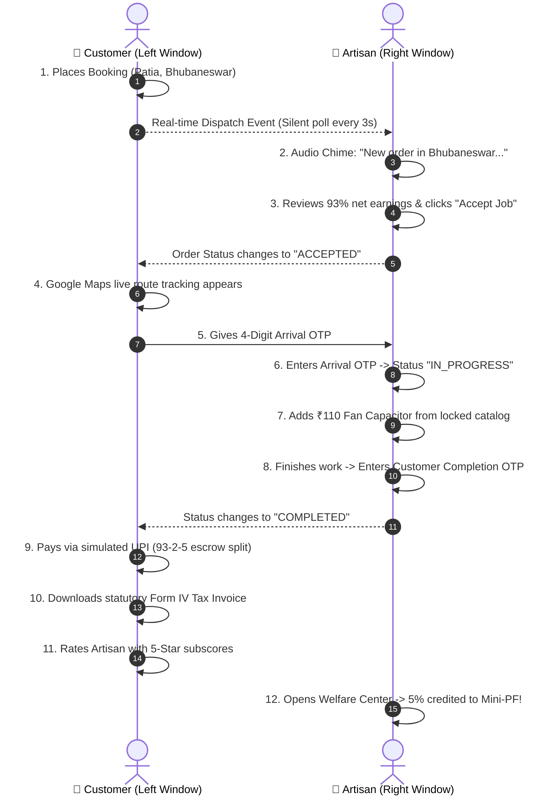

# 🎭 Live Presentation Demo Script & Step-by-Step Test Guide

> **Purpose:** Use this document when demonstrating **Sahakari Shram Setu** live in front of evaluators, clients, or judges. It walks through an end-to-end citizen booking, instant real-time worker dispatch alert, Google Maps live tracking, OTP handshakes, 93-2-5 escrow payout, and Form IV tax invoicing.

---

## 🖥️ Screen Setup Before You Begin

Open **two browser windows side-by-side**:

| Window | Role | Browser Mode | URL | Login Email | Password |
| :--- | :--- | :--- | :--- | :--- | :--- |
| **LEFT SCREEN** | **👤 Citizen (Customer)** | Normal Window | `http://localhost:5173/login` | `customer@demo.local` | `demo123` |
| **RIGHT SCREEN** | **👷 Worker (Artisan)** | Incognito Window | `http://localhost:5173/login?portal=worker` | `ramesh.w@demo.local` | `demo123` |

> 💡 **Tip:** If presenting on a projector, keep both windows open at 50% width on your screen so the audience sees the real-time interaction simultaneously!

---

## ⏱️ Live Demo Walkthrough (8-Minute Presentation Flow)



---

### Step 1: Customer Places a Booking (Left Window)
1. In the **Left Window**, log in as **Ananya Patel** (`customer@demo.local` / `demo123`).
2. Click **"Book a Service"** or go to `http://localhost:5173/book-service`.
3. **Select Service:**
   - Trade: **Electrical**
   - Service: **Ceiling Fan Repair & Capacitor Replacement** (Base ₹249).
4. **Select Location & Time:**
   - District: **Khordha (Bhubaneswar)**
   - Address: `Patia, Plot 42, Near KIIT Campus, Bhubaneswar` (Pincode: `751024`).
   - Slot: Select Today's date and any afternoon slot.
5. **Smart Matching Wizard:**
   - Point out the **93-2-5 Escrow Tariff Transparency**:
     - *₹231.57 (93%)* directly to the artisan.
     - *₹12.45 (5%)* to the Artisan PF & Social Security Fund.
     - *₹4.98 (2%)* platform maintenance.
   - Show the recommended worker: **Ramesh Kumar** (*Master Electrician • ITI Gold Certified • 1.2 km away*).
6. Click **"Confirm Booking"**.
   - Note the generated Booking Code (e.g. `BKG-2026-0013`) and the **4-digit Arrival OTP** displayed on screen (e.g. `4821`).

---

### Step 2: Live Dispatch Alert & Job Acceptance (Right Window)
1. Switch to the **Right Window** (logged in as **Ramesh Kumar** on `/worker-dashboard`).
2. Point out the top status toggle: **"Status: AVAILABLE (Duty On)"**.
3. Within 3 seconds, the real-time dispatch audio chimes aloud:
   > *"New broadcast order in Bhubaneswar. Ceiling Fan Repair."*
4. The incoming job card pops up:
   - **Customer:** Ananya Patel (Patia)
   - **Service:** Ceiling Fan Repair
   - **Net Worker Payout:** ₹231.57 (Guaranteed 93% living wage)
5. Click the green **"Accept Job"** button.

---

### Step 3: Real-Time Google Maps Tracking (Left Window)
1. Look at the **Left Window** (Customer screen):
   - The booking automatically updates from `REQUESTED` to **`ACCEPTED`** without refreshing!
2. Click into the booking detail to reveal the **Google Maps Engine**:
   - **Google Maps Canvas** renders turn-by-turn driving directions from Ramesh Kumar in Rasulgarh to Ananya Patel in Patia.
   - Point out the **Live GPS Telemetry Bar**:
     - `Google GPS: Live`
     - `Transit Distance: 3.9 km`
     - `Estimated Speed: 28 km/h`
     - `ETA: ~13 Mins`
   - Show the interactive map controls:
     - Click **"🚗 Route"** (driving path).
     - Click **"📍 Destination"** (customer home pin).
     - Click **"Google Maps App"** (opens native turn-by-turn navigation in a new tab).

---

### Step 4: Arrival OTP Handshake (Right Window)
1. In the **Right Window** (Worker screen), Ramesh arrives at the customer's home.
2. The customer verbally provides their 4-digit **Arrival OTP** (`4821`).
3. Ramesh inputs `4821` and clicks **"Verify Arrival"**.
4. The system validates the biometric handshake:
   - Status transitions to **`IN_PROGRESS`**.
   - Arrival timestamp is stamped into the immutable database audit trail.

---

### Step 5: Adding Regulated Spare Parts (Right Window)
1. Ramesh inspects the ceiling fan and diagnoses a burnt capacitor.
2. In the Worker window, click **"Add Replacement Parts"**.
3. Select from the **Locked Parts Catalog**:
   - Part: **Orient 2.5uF Fan Capacitor** (Regulated Price: **₹110**).
   - Warranty: **6 Months Statutory Warranty**.
4. Click **"Add to Work Order"**.
5. Point out to your audience:
   > *"Unlike commercial gig apps where workers arbitrarily inflate parts costs, Shram Setu locks replacement parts to government-approved rates with mandatory warranty coverage."*

---

### Step 6: Completion OTP & 30-Day Guarantee (Both Windows)
1. Ramesh completes the fan repair and tests smooth rotation.
2. In the Worker window, click **"Request Job Completion"**.
3. Customer screen displays the 4-digit **Completion OTP** (`7193`).
4. Ramesh enters `7193` and clicks **"Confirm Completion"**.
5. Both screens update to **`COMPLETED`**:
   - The **30-Day Free Workmanship Guarantee** is armed automatically.

---

### Step 7: Instant UPI Payment & Form IV Tax Invoice (Left Window)
1. In the **Left Window** (Customer), click **"Pay Regulated Tariff"**.
2. Total amount reflects: `Base Labor (₹249) + Capacitor (₹110) + Cooperative & Platform Levies`.
3. Select **"UPI (Google Pay / PhonePe)"** and click **"Simulate Successful Payment"**.
4. Click **"View Form IV Tax Invoice"**:
   - Displays statutory cooperative tax invoice with GSTIN, NLCF Affiliation, itemized spare parts, and 93-2-5 escrow breakdown.
   - Click **"Print / Save PDF"** to demonstrate print-ready format.

---

### Step 8: Citizen Rating & Worker Social Security Verification
1. **Citizen Review (Left Window):**
   - Click **"Rate Service"**.
   - Give 5 Stars with tags: *Punctual & Prompt*, *Master Workmanship*.
   - Comment: *"Ramesh bhai arrived quickly and replaced the fan capacitor with genuine warranty parts. Fantastic cooperative service!"*
   - Submit review.
2. **Dual-Perspective Reviews on Home Page:**
   - Go to `http://localhost:5173/` and scroll to **Community Reviews**.
   - Show how Customer reviews and Worker testimonials sit side-by-side with voice read-aloud.
3. **Worker Welfare Center (Right Window):**
   - In Ramesh's window, navigate to `http://localhost:5173/worker-welfare`.
   - Show how the **5% statutory welfare contribution** from this booking was automatically added to his:
     - **ESIC Accident & Medical Insurance Policy**
     - **Accumulated Mini-PF Retirement Corpus**
   - Show the 1-click **"Enroll in NSDC Upskilling Workshop"** button.

---

## 🎯 Quick Reference Cheat Sheet

| Feature to Highlight | Where to Show | Key Talking Point for Judges |
| :--- | :--- | :--- |
| **93-2-5 Living Wage Model** | Booking Screen & Invoice | 93% goes directly to the artisan. Commercial apps deduct 25% to 30% in corporate commissions. |
| **Dual-Perspective Reviews** | Home Page (`/`) | Real reviews from both citizens (service quality) and workers (dignified livelihoods & insurance). |
| **Google Maps Live Telemetry** | Booking Detail (`/bookings/:id`) | Live GPS transit distance, speed calibration, and native Google Maps navigation app deep link. |
| **2-Way OTP Security** | Arrival & Completion | Fraud-proof handshakes prevent false arrivals or unfinished jobs before payment. |
| **Locked Parts Catalog** | Add Parts Modal | Eliminates doorstep overcharging with fixed rate card pricing and statutory warranty. |
| **Social Security & Mini-PF** | Worker Welfare (`/worker-welfare`) | 5% of every job builds a long-term retirement and accident safety net for unorganized labour. |

---

## 🛠️ Instant Reset Command
If you ever want to reset the database back to clean demo data for another presentation run:
```bash
npm run seed
```
*(Clears all bookings and restores fresh sample data in 3 seconds).*
