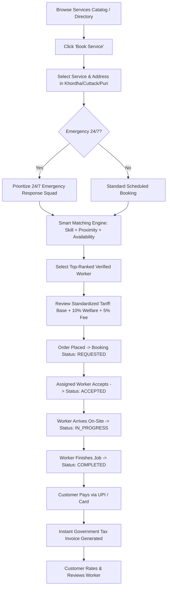
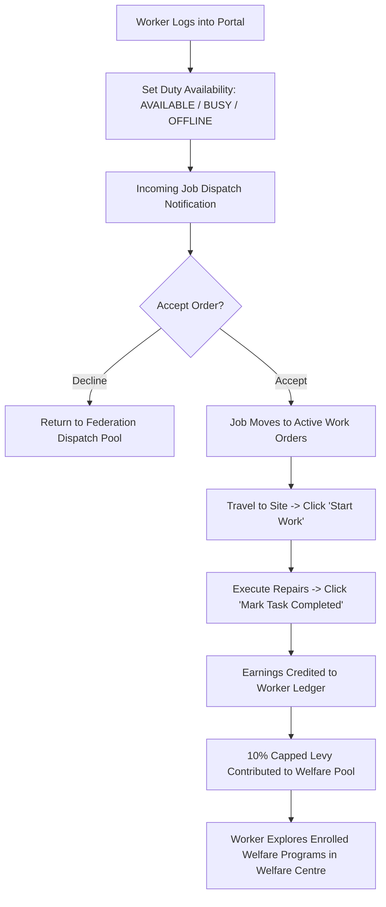
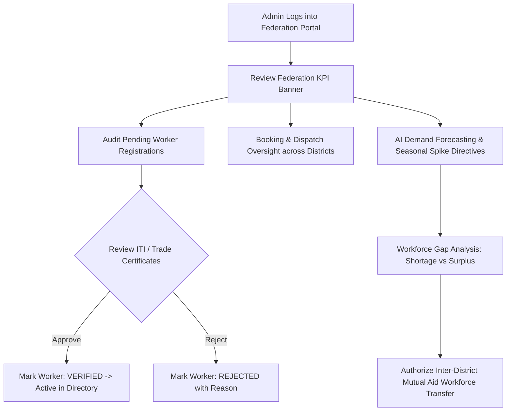

# System Workflows & User Journeys — Shram Setu

This document outlines the detailed workflows across all platform roles and actors.

---

## 1. 👤 Citizen / Customer Workflow

### Key Customer Steps:
1. **Service Selection**: Citizen explores catalog with government standard rates.
2. **Smart Matching Wizard**: 4-step wizard with location selection and instant worker recommendations scored by algorithm.
3. **Transparent Quotation**: Clear breakdown of 10% worker social security contribution.
4. **Lifecycle Tracking**: 5-step visual progress bar with direct phone link to assigned worker.
5. **Payment & Invoicing**: Instant UPI simulation and printable tax invoice.
6. **Citizen Review**: 5-star rating with quality tags to support cooperative worker ranking.

---

## 2. 👷 Worker Member Workflow

### Key Worker Steps:
1. **Duty Availability**: 1-click status switch ensuring workers maintain autonomy over working hours.
2. **Dispatch Queue**: Incoming work requests with customer location and payout value.
3. **On-Site Execution**: Progression from Start Work to Task Completed.
4. **Earnings Ledger**: Transparent history of payouts without arbitrary platform commission cuts.
5. **Worker Welfare Centre**: Direct visibility into ESIC accident cover, health cards, EPFO pensions, and 1-click NSDC workshop enrollments.

---

## 3. 🏢 Cooperative Administrator Workflow

### Key Administrator Steps:
1. **Federation Oversight**: Monitor active dispatches, completed gigs, emergency volume, and earnings across all member societies.
2. **Worker Verification**: Review submitted trade licenses and ITI credentials before activating workers on the public directory.
3. **AI Demand Forecasting**: Monitor 4-week predictive demand tables and seasonal weather directives.
4. **Inter-Cooperative Mutual Aid**: Authorize temporary inter-district worker transfer agreements to balance regional shortages.
